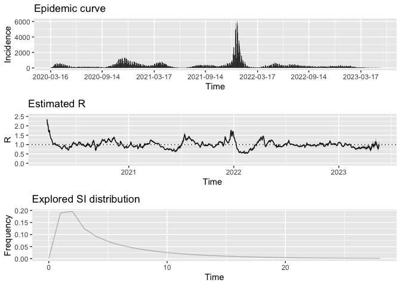

covid19-philadelphia
================

### About this repo

De-identified, aggregate datasets showing COVID-19 cases,
hospitalizations, deaths and vaccinations by date, zip, or age/sex/race
as made available by the City of Philadelphia through its Open Data
Program.

The data in this repository is a history of daily snapshots made
available here:
<https://www.opendataphilly.org/showcase/philadelphia-covid-19-information>

The following datasets have been collected since 6/4/2020:

-   COVID Cases by Age
-   COVID Cases by Date
-   COVID Cases by Sex
-   COVID Cases by Zipcode
-   COVID Deaths by Age
-   COVID Deaths by Date
-   COVID Deaths by Sex

These have been collected since 8/14/2020:

-   COVID Cases by Race
-   COVID Deaths by Race
-   COVID Hospitalizations by Age
-   COVID Hospitalizations by Date
-   COVID Hospitalizations by Race
-   COVID Hospitalizations by Sex
-   COVID Hospitalizations by Zipcode

These have been collected since 3/21/2021:

-   COVID Vaccinations Total
-   COVID Vaccinations by Age
-   COVID Vaccinations by Race
-   COVID Vaccinations by Sex
-   COVID Vaccinations by Zipcode

We are working to backfill all the datasets with the entire history
prior to the dates above and make them available here for use by the
open data community.

Data reporting changes:

-   Starting on September 29, 2020, COVID Cases by Date are reported by
    test specimen collection date; prior to this date, these were
    reported by test result date. This repository keeps the entire
    history with test result date showing null and test specimen
    collection date populated after this change.
-   Beginning May 3, 2021, the Health Department is reporting testing
    data twice weekly around 1:30 p.m. every Monday and Thursday. This
    repository will continue to run daily updates with the latest
    information posted by 2:00 p.m.

Questions about these datasets? Visit the OpenDataPhilly Discussion
Group: <https://groups.google.com/forum/#!forum/opendataphilly>

For terms of use:
<https://www.opendataphilly.org/organization/about/city-of-philadelphia>

------------------------------------------------------------------------

### How to use

To get started reading and analyzing the data:

-   Clone this repo
-   If you use R/RStudio, open a new project based on an existing
    folder, pointing to the local copy of the repo
-   Setup the following environment variable in \~/.Renviron, completing
    /\<…>/ based on the repo location in your local folder structure:

<!-- -->

    COVID19PHILLY_DIR='~/<...>/ambientpointcorp/covid19-philadelphia/'

-   Set up cron jobs in your local machine with the cronR or
    taskscheduleR package:
    <https://cran.r-project.org/web/packages/cronR/vignettes/cronR.html>

<!-- -->

    library(cronR)
    library(stringr)

    # Daily cron job to fetch cases
    cmd_cases <- cron_rscript(rscript = str_c(Sys.getenv("COVID19PHILLY_DIR"),
                                              "philadelphia_covid19_cases_cron.R"))
    cron_add(command = cmd_cases, frequency = 'daily', at='2PM', id = 'covid19_cases')

    # Daily cron job to fetch deaths
    cmd_deaths <- cron_rscript(rscript = str_c(Sys.getenv("COVID19PHILLY_DIR"),
                                               "philadelphia_covid19_deaths_cron.R"))
    cron_add(command = cmd_deaths, frequency = 'daily', at='2PM', id = 'covid19_deaths')

    # Daily cron job to fetch hospitalizations
    cmd_hosp <- cron_rscript(rscript = str_c(Sys.getenv("COVID19PHILLY_DIR"),
                                      "philadelphia_covid19_hospitalizations_cron.R"))
    cron_add(command = cmd_hosp, frequency = 'daily', at='2PM', id = 'covid19_hospitalizations')

    # Daily cron job to fetch vaccinations
    cmd_vaccs <- cron_rscript(rscript = str_c(Sys.getenv("COVID19PHILLY_DIR"),
                                          "philadelphia_covid19_vaccinations_cron.R"))
    cron_add(command = cmd_vaccs, frequency = 'daily', at='2PM', id = 'covid19_vaccinations')

    # Check scheduled jobs
    cron_njobs()
    cron_ls()

------------------------------------------------------------------------

### Read all the files within a folder as a historical dataset, for example:

``` r
library(tidyverse)

# Stack daily files within folder and keep distinct records
build_historical_dataset <- function(data_folder) {
  list.files(path = data_folder, full.names = TRUE) %>%
    map_dfr(read_csv) %>%
    distinct() # duplicates occur when there is an extract but no data update
}

# Cases by test result and reporting dates
cases_by_date <- build_historical_dataset("cases_by_date")
cases_by_date
```

    ## # A tibble: 227,071 × 5
    ##    result_date etl_timestamp       positive negative collection_date
    ##    <date>      <dttm>                 <dbl>    <dbl> <date>         
    ##  1 2020-03-27  2020-06-04 17:20:02      222      769 NA             
    ##  2 2020-05-05  2020-06-04 17:20:02      362     1252 NA             
    ##  3 2020-05-30  2020-06-04 17:20:02      126     1525 NA             
    ##  4 2020-03-24  2020-06-04 17:20:02      115      477 NA             
    ##  5 2020-04-26  2020-06-04 17:20:02      204      620 NA             
    ##  6 2020-05-23  2020-06-04 17:20:02      192     1535 NA             
    ##  7 2020-04-16  2020-06-04 17:20:02      524      772 NA             
    ##  8 2020-05-01  2020-06-04 17:20:02      414     1104 NA             
    ##  9 2020-05-20  2020-06-04 17:20:02      193     1697 NA             
    ## 10 2020-04-24  2020-06-04 17:20:02      490     1147 NA             
    ## # … with 227,061 more rows

``` r
# Cases by zip code and reporting date
cases_by_zipcode <- build_historical_dataset("cases_by_zipcode")
cases_by_zipcode
```

    ## # A tibble: 38,632 × 4
    ##    zip_code etl_timestamp         NEG   POS
    ##       <dbl> <dttm>              <dbl> <dbl>
    ##  1    19122 2020-06-01 17:20:02  1018   245
    ##  2    19101 2020-06-01 17:20:02    36    27
    ##  3    19146 2020-06-01 17:20:02  2515   438
    ##  4    19153 2020-06-01 17:20:02   610   197
    ##  5    19136 2020-06-01 17:20:02  4456   894
    ##  6    19143 2020-06-01 17:20:02  3805  1019
    ##  7    19152 2020-06-01 17:20:02  1473   601
    ##  8    19125 2020-06-01 17:20:02  1117   204
    ##  9    19106 2020-06-01 17:20:02   589    55
    ## 10    19132 2020-06-01 17:20:02  1720   573
    ## # … with 38,622 more rows

### Analysis: COVID-19’s incidence and effective reproductive number in Philly

``` r
library(lubridate)
library(EpiEstim)

# Daily case count by test result date
incidence_data <- list.files(path = "cases_by_date", full.names = TRUE) %>% 
  last %>% 
  read_csv(col_types = cols(collection_date = col_character(),
                            etl_timestamp = col_skip(),
                            negative = col_integer(),
                            positive = col_integer())) %>% 
  filter(!is.na(positive) & (date(collection_date) >= date("2020-03-16"))) %>%
  mutate(dates = date(collection_date)) %>%
  arrange(dates) %>%
  mutate(positivity_rate = positive / (positive + negative)) %>%
  select(dates, positive, negative, positivity_rate) %>%
  filter(dates <= last(dates) - 3) # remove last 3 days considering lag in test results

# Plot incidence and effective reproductive number over time
# Serial interval mean and std estimates from: https://www.dhs.gov/publication/st-master-question-list-covid-19
res_parametric_si <- estimate_R(incidence_data %>% 
                                  select(dates, I = positive),
                                method="parametric_si",
                                config = make_config(list(mean_si = 5.29, std_si = 5.32)))
plot(res_parametric_si, legend = FALSE)
```

<!-- -->
